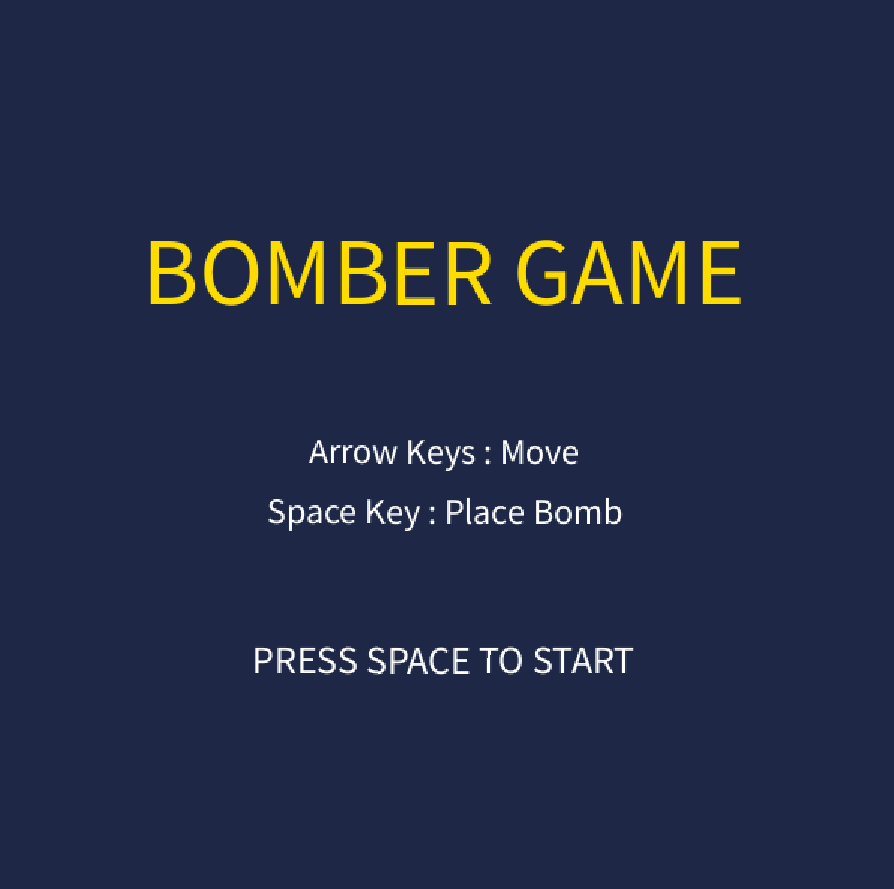

#  取扱説明書

## 概要
本アプリは爆弾を設置して敵や障害物を倒しながらステージを攻略する、対戦型アクションゲームである。プレイヤーはキャラクターを操作し、フィールド内に爆弾を配置することで一定時間後に爆発を起こす。爆風の範囲を利用して敵を攻撃したり、道を塞ぐ障害物を破壊したりしながら、ステージクリアを目指す。

---

## 起動方法
 タイトル画面で**SPACEキー**を押す

   

---

## 操作方法

| キー    | 操作           |
| ------- | -------------- |
| ← ↑ ↓ → | 移動           |
| Space   | 爆弾を設置     |
| Restart | リスタート     |
| Title   | タイトルへ戻る |

---

## ゲームルール

- 制限時間は5分
- 爆弾は一定時間後に爆発する
- 爆風でブロックを壊せる
- 壁は壊せない
- 爆風は他の爆弾を誘爆できる
- 敵を全員倒すとクリア
- 爆風に当たるか時間切れでゲームオーバー

---

## アイテム
### 1. Fire Item  爆風範囲が1増える

  
### 2. Bomb Item  設置できる爆弾数が1増える 

---

## キャラクター紹介

：プレイヤー

：ホワイト

：ジャパン

：ドイツ

